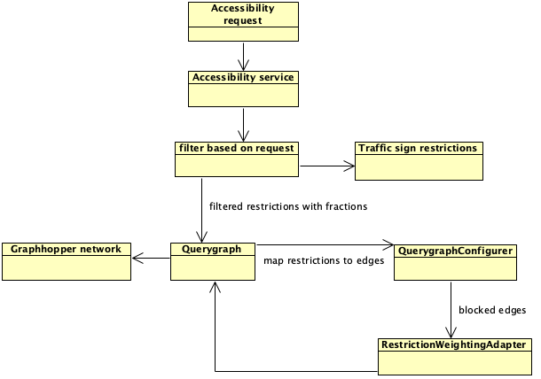
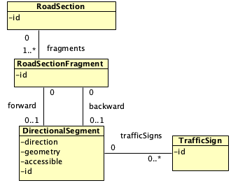

# General overview

This document will provide a more detailed technical description of the accessibility application and it's functionalities.
The application uses the shortest path tree algorithm to calculate non-accessible roads given a request with vehicle characteristics.
It does so by calculating the difference in output for a calculation without restrictions and with restrictions.

## Original setup

When this project was first created the traffic sign restrictions were encoded directly on the network as Edge attributes.
This integrates well with the graphhopper custom model api to customise access on edges.
A custom model allows you to modify the default behavior of a vehicle profile by specifying a set of rule expressions.
 

There are however a number of drawbacks to this approach.

1. If a traffic sign was not placed at the beginning or the end of the edge but on a fraction this was not possible to encode.
2. When no direction was specified in the data a traffic sign was placed on both sides of the road section.
3. Restriction calculation of more complex use cases (ie time based access) was not supported because only simple values are supported as
   encoded values.

## New setup

In order to accommodate aforementioned shortcomings a new approach was investigated.
This involved moving away from the graphhopper custom model api and creating a new implementation to handle edge restrictions.
The first step was to use the functionality provided by Graphhoppers' Querygraph class to add support for fractionally placed edge restrictions.
The query graph is used in graphhopper to allow adding via points for routing among others.
This 'network cutting functionality' comes in handy when you want to precisely calculate the accessibility based on fractionally placed traffic sign restrictions.
Furthermore, the traffic sign restrictions are not encoded on the network but calculated per request.
The traffic sign restrictions are then associated with the correct edges (edge keys) and passed to a custom weighting adapter.
This weighting adapter then blocks access to an edge if it encounters an edge in the set of blocked edges.
The disadvantage is that it does not integrate with the graphhopper custom model api.
But because the restriction calculation is done entirely separate from graphhopper it allows for more complex use cases.

Another important change is the aggregation of the graphhopper shortest path tree algorithm output into a comprehensive domain model. 
This reduces the complexity of the application significantly because almost all functional requirements can be derived from this model.

### Schematic overview of the application's request flow

### Domain model

# Glossary

| Term         | Definition                                                                                                                              |
|--------------|-----------------------------------------------------------------------------------------------------------------------------------------|
| Custom model | Graphhopper internal api to customise access and speed based on dynamic expression evaluation of edge attribute values                  |
| Edge         | Road section traversable in one or two directions between 2 nodes                                                                       |
| Edge id      | Direction independent unique identifier of the edge                                                                                     |
| Edge key     | Direction dependent unique identifier of the edge                                                                                       |
| Graphhopper  | Java library for network routing                                                                                                        |
| Node         | Junction between different connecting edges                                                                                             |
| Querygraph   | Graphhopper utility to create a separate per request data layer in which the original edges can be cut into sub edges based on the snap |
| Snap         | Representation of a graphhopper snapped point on the network containing information about the closest node and edge                     |
| Virtual node | A node created only in de Querygraph data layer if the snap is not at the beginning or the end of an original edge                      |
| Virtual edge | An edge created only in de Querygraph data layer if the snap is not at the beginning or the end of an original edge                     |

# References

- [Graphhopper](https://github.com/graphhopper/graphhopper)
- [Graphopper Custom Models](https://github.com/graphhopper/graphhopper/blob/master/docs/core/custom-models.md)
- [Querygraph](https://github.com/graphhopper/graphhopper/blob/master/docs/core/low-level-api.md)
- [Shortest path tree algorithm ](https://en.wikipedia.org/wiki/Shortest-path_tree)
- [Shortest path tree in graphopper](https://github.com/graphhopper/graphhopper/blob/master/docs/isochrone/java.md)
