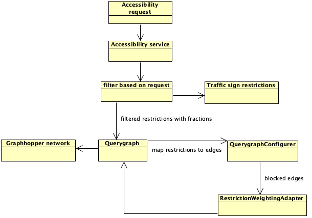
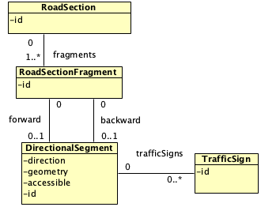

# General overview

This document will provide a more detailed technical description of the accessibility application and it's functionalities.
The application uses the shortest path tree algorithm to calculate non-accessible roads given a request with vehicle characteristics.
It does so by calculating the difference in output for a calculation without restrictions and with restrictions.

## Original setup

<p>
When this project was first created the traffic sign restrictions were encoded directly on the network as Edge attributes.
This integrates well with the graphhopper custom model api to customise access on edges.
A custom model allows you to modify the default behavior of a vehicle profile by specifying a set of rule expressions.
 </p>
<p>There are however a number of drawbacks to this approach.</p>

1. If a traffic sign was not placed at the beginning or the end of the edge but on a fraction this was not possible to encode.
2. When no direction was specified in the data a traffic sign was placed on both sides of the road section.
3. Restriction calculation of more complex use cases (ie time based access) was not supported because only simple values are supported as
   encoded values.

## New setup

<p>
In order to accommodate aforementioned shortcomings a new approach was investigated.
This involved moving away from the graphhopper custom model api and creating a new implementation to handle edge restrictions.
The first step was to use the functionality provided by Graphhoppers' Querygraph class to add support for fractionally placed edge restrictions.
The query graph is used in graphhopper to allow adding via points for routing among others.
This 'network cutting functionality' comes in handy when you want to precisely calculate the accessibility based on fractionally placed traffic sign restrictions.
Furthermore, the traffic sign restrictions are not encoded on the network but calculated per request.
The traffic sign restrictions are then associated with the correct edges (edge keys) and passed to a custom weighting adapter.
This weighting adapter then blocks access to an edge if it encounters an edge in the set of blocked edges.
The disadvantage is that a custom implementation had to be made because the restriction calculation is done entirely separate from graphhopper.
But because the restriction calculation is done entirely separate from graphhopper it allows for more complex use cases.
</p>
<p>
Another important change is the aggregation of the graphhopper shortest path tree algorithm output into a comprehensive domain model. 
This reduces the complexity of the application significantly because almost all functional requirements can be derived from this model.
</p>

### Schematic overview of the application's request flow



### Domain model



## Bidirectional routing and edge orientation in combination with search direction

Our road accessibility is **not encoded in the GraphHopper graph** using an `EncodedValue`. Instead, accessibility is determined at runtime
by looking up the corresponding NWB road section in a cache.

The NWB stores accessibility relative to the **original road section direction**:

* `forwardAccessible` — travel is allowed in the NWB direction.
* `backwardAccessible` — travel is allowed opposite to the NWB direction.

GraphHopper, however, does not always present an edge in its original orientation.

### Edge orientation

An `EdgeIteratorState` can represent the same physical edge in two orientations.

Original NWB road section:

```text
A ----------> B
```

Normal orientation:

```text
base = A
adj  = B
edgeState.reverse = false
```

Reversed orientation:

```text
base = B
adj  = A
edgeState.reverse = true
```

The `edgeState.reverse` flag indicates whether the current `EdgeIteratorState` is reversed relative to the stored edge.

### Search direction

The `reverse` parameter passed to `Weighting.calcEdgeWeight(...)` has a different meaning.

* `reverse == false` indicates the **forward search** (from source).
* `reverse == true` indicates the **backward search** (from target) used by bidirectional routing.

It does **not** directly indicate whether the vehicle is travelling opposite to the original road section direction.

### Determining the actual travel direction

To determine whether traversal is forward or backward relative to the original NWB road section, both the edge orientation and the search
direction must be taken into account.

This is an exclusive OR (XOR) operation.

| Edge orientation (`edgeState.reverse`) | Search (`reverse`) | Traversal backward relative to NWB |
|----------------------------------------|--------------------|------------------------------------|
| false                                  | false              | false (forward)                    |
| false                                  | true               | true (backward)                    |
| true                                   | false              | true (backward)                    |
| true                                   | true               | false (forward)                    |

This corresponds to an exclusive OR (XOR):

```java
boolean traversingBackwardRelativeToRoad = reverseSearch ^ edgeIsReversed;
```

where:

* `edgeIsReversed` indicates whether the `EdgeIteratorState` is reversed relative to the original NWB road section.
* `reverseSearch` indicates whether GraphHopper is executing the backward search.

The resulting value determines whether `forwardAccessible` or `backwardAccessible` should be used when evaluating accessibility.

### Why this is necessary

This issue became particularly apparent on **one-way roads**.

A standard (forward-only) Dijkstra search only evaluates edges in the forward search direction, so the accessibility check is always
performed against the expected road orientation.

Bidirectional Dijkstra, however, performs a simultaneous search from both the source and the destination. During the backward search,
GraphHopper may present an edge in the opposite orientation while also indicating that it is part of the reverse search. If accessibility is
determined using only the `reverse` parameter, the road can be evaluated against the wrong NWB direction.

For one-way roads, this means the backward search may incorrectly conclude that a perfectly valid edge is not traversable, preventing the
forward and backward search frontiers from connecting. As a result, `Dijkstra` can successfully find a route while `DijkstraBidirection`
reports that no route exists.

By combining the edge orientation (`edgeState.reverse`) with the search direction (`reverse`) using an XOR, accessibility is always
evaluated relative to the original NWB road section direction. This ensures that both forward and bidirectional routing interpret one-way
roads consistently.

# Glossary

| Term         | Definition                                                                                                                              |
|--------------|-----------------------------------------------------------------------------------------------------------------------------------------|
| Custom model | Graphhopper internal api to customise access and speed based on dynamic expression evaluation of edge attribute values                  |
| Edge         | Road section traversable in one or two directions between 2 nodes                                                                       |
| Edge id      | Direction independent unique identifier of the edge                                                                                     |
| Edge key     | Direction dependent unique identifier of the edge                                                                                       |
| Graphhopper  | Java library for network routing                                                                                                        |
| Node         | Junction between different connecting edges                                                                                             |
| Querygraph   | Graphhopper utility to create a separate per request data layer in which the original edges can be cut into sub edges based on the snap |
| Snap         | Representation of a graphhopper snapped point on the network containing information about the closest node and edge                     |
| Virtual node | A node created only in de Querygraph data layer if the snap is not at the beginning or the end of an original edge                      |
| Virtual edge | An edge created only in de Querygraph data layer if the snap is not at the beginning or the end of an original edge                     |

# References

- [Graphhopper](https://github.com/graphhopper/graphhopper)
- [Graphopper Custom Models](https://github.com/graphhopper/graphhopper/blob/master/docs/core/custom-models.md)
- [Querygraph](https://github.com/graphhopper/graphhopper/blob/master/docs/core/low-level-api.md)
- [Shortest path tree algorithm ](https://en.wikipedia.org/wiki/Shortest-path_tree)
- [Shortest path tree in graphopper](https://github.com/graphhopper/graphhopper/blob/master/docs/isochrone/java.md)
